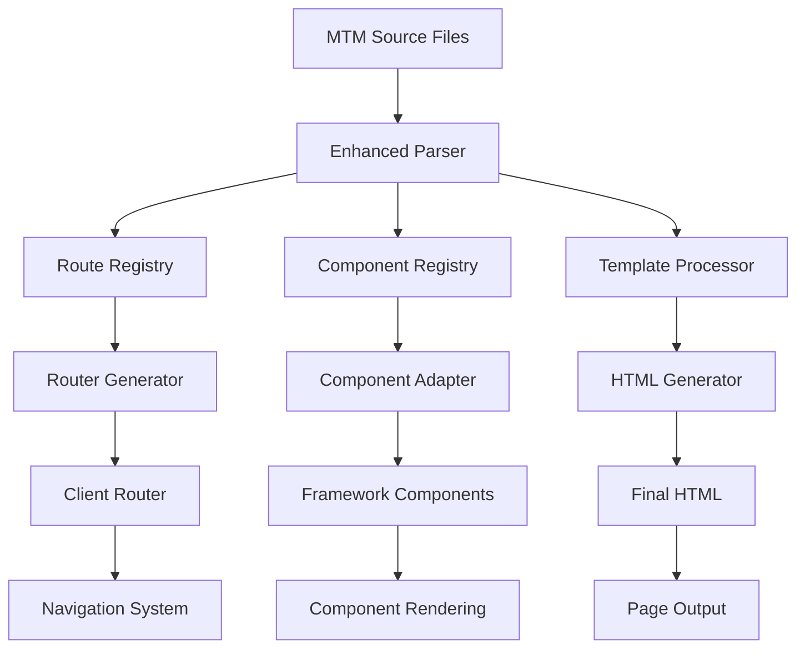

# Design Document

## Overview

The Enhanced Routing Multi-Framework system extends the existing MTM framework with a comprehensive routing solution that supports frontmatter-based route configuration, client-side navigation using standard HTML anchor tags, flexible JavaScript compilation modes, and seamless integration with React, Vue, Solid, and Svelte components. The design builds upon the existing MTM compiler architecture while adding new capabilities for multi-framework support and advanced routing features.

## Architecture

### Core Components

1. **Enhanced MTM Parser**: Extends the existing parser to handle frontmatter configuration, import statements, and multi-framework syntax
2. **Route Registry**: Manages route definitions and provides route resolution capabilities
3. **Component Adapter System**: Provides unified interfaces for different framework components
4. **Client-Side Router**: Handles navigation, history management, and page transitions
5. **Build System Integration**: Manages compilation modes and framework-specific optimizations

### System Flow



## Components and Interfaces

### Enhanced MTM Parser

```typescript
interface EnhancedMTMParser {
  parseFrontmatter(source: string): FrontmatterConfig;
  parseImports(source: string): ComponentImport[];
  parseTemplate(source: string): TemplateAST;
  parseVariables(source: string): Variable[];
  parseFunctions(source: string): Function[];
}

interface FrontmatterConfig {
  route?: string;
  compileJsMode?: "inline" | "external.js" | string;
  title?: string;
  description?: string;
  [key: string]: any;
}

interface ComponentImport {
  name: string;
  path: string;
  framework: "react" | "vue" | "solid" | "svelte";
  resolved: string;
}
```

### Route Registry

```typescript
interface RouteRegistry {
  register(route: string, config: RouteConfig): void;
  resolve(path: string): RouteMatch | null;
  getAll(): Map<string, RouteConfig>;
  validateRoutes(): ValidationResult[];
}

interface RouteConfig {
  path: string;
  file: string;
  metadata: FrontmatterConfig;
  component: string;
  params?: string[];
}

interface RouteMatch {
  route: RouteConfig;
  params: Record<string, string>;
  query: Record<string, string>;
}
```

### Component Adapter System

```typescript
interface ComponentAdapter {
  framework: string;
  canHandle(importPath: string): boolean;
  transform(component: ComponentImport): ComponentDefinition;
  generateWrapper(component: ComponentDefinition): string;
}

interface ComponentDefinition {
  name: string;
  framework: string;
  source: string;
  props: PropDefinition[];
  dependencies: string[];
}

interface PropDefinition {
  name: string;
  type: string;
  required: boolean;
  default?: any;
}
```

### Client-Side Router

```typescript
interface ClientRouter {
  navigate(path: string): void;
  back(): void;
  forward(): void;
  replace(path: string): void;
  getCurrentRoute(): RouteMatch | null;
  onRouteChange(callback: (route: RouteMatch) => void): void;
}

interface NavigationOptions {
  replace?: boolean;
  state?: any;
  preserveScroll?: boolean;
}
```

## Data Models

### MTM File Structure

```yaml
# Frontmatter Configuration
---
route: "/user/profile"
compileJsMode: "external.js"
title: "User Profile"
description: "User profile management page"
keywords: "a, b, c"
---

# Import Statements
import UserCard from "@components/UserCard.tsx"
import ProfileForm from "@components/ProfileForm.vue"
import NotificationBell from "@components/NotificationBell.svelte"

# Variables and Functions
$user! = signal('user', { name: 'John', email: 'john@example.com' })
$notifications! = signal('notifications', [])

$handleSave = () => {
  // Save user profile
  console.log('Saving profile:', $user)
}

# Template
<template>
  <div class="profile-page">
    <h1>Welcome, {$user.name}!</h1>
    <UserCard user={$user} />
    <ProfileForm user={$user} onSave={$handleSave} />
    <NotificationBell notifications={$notifications} />

    <nav>
      <a href="/dashboard">Dashboard</a>
      <a href="/settings">Settings</a>
    </nav>
  </div>
</template>
```

### Route Configuration

```typescript
interface RouteDefinition {
  path: string; // "/user/[id]/profile"
  file: string; // "pages/user/profile.mtm"
  component: string; // "UserProfilePage"
  metadata: {
    title: string;
    description: string;
    compileJsMode: string;
    keywords: string;
    [key: string]: any;
  };
  params: string[]; // ["id"]
  dynamic: boolean; // true if contains [param]
}
```

### Component Registry

```typescript
interface ComponentRegistry {
  components: Map<string, ComponentDefinition>;
  adapters: Map<string, ComponentAdapter>;

  register(component: ComponentDefinition): void;
  resolve(name: string): ComponentDefinition | null;
  getAdapter(framework: string): ComponentAdapter | null;
}
```

## Error Handling

### Compilation Errors

1. **Route Conflicts**: When multiple files define the same route
2. **Import Resolution**: When component imports cannot be resolved
3. **Syntax Errors**: When MTM syntax is invalid
4. **Framework Compatibility**: When components are incompatible

```typescript
interface CompilationError {
  type:
    | "route-conflict"
    | "import-resolution"
    | "syntax-error"
    | "framework-compatibility";
  message: string;
  file: string;
  line?: number;
  column?: number;
  suggestions?: string[];
}
```

### Runtime Errors

1. **Navigation Errors**: When routes cannot be resolved
2. **Component Mounting**: When components fail to mount
3. **State Management**: When signals fail to update

```typescript
interface RuntimeError {
  type: "navigation" | "component-mount" | "state-management";
  message: string;
  stack?: string;
  context?: any;
}
```

## Testing Strategy

### Unit Tests

1. **Parser Tests**: Validate frontmatter parsing, import resolution, template processing
2. **Router Tests**: Test route registration, resolution, navigation
3. **Component Adapter Tests**: Verify framework-specific transformations
4. **Compilation Tests**: Ensure correct HTML/JS generation

### Integration Tests

1. **Multi-Framework Tests**: Verify React, Vue, Solid, Svelte components work together
2. **Navigation Tests**: Test client-side routing with browser history
3. **Build System Tests**: Validate different compilation modes
4. **Performance Tests**: Measure bundle sizes and load times

### End-to-End Tests

1. **User Journey Tests**: Complete navigation flows
2. **Browser Compatibility**: Cross-browser testing
3. **Production Build Tests**: Verify optimized builds work correctly

## Implementation Phases

### Phase 1: Core Infrastructure

- Enhanced parser with frontmatter support
- Route registry implementation
- Basic client-side router
- HTML anchor tag interception

### Phase 2: Multi-Framework Support

- Component adapter system
- React component integration
- Vue component integration
- Import resolution system

### Phase 3: Advanced Features

- Solid and Svelte support
- Dynamic routing with parameters
- Compilation mode options
- Performance optimizations

### Phase 4: Developer Experience

- Comprehensive examples
- Error handling improvements
- Development tools
- Documentation

## Framework-Specific Considerations

### React Integration

- Use React.createElement for component instantiation
- Handle JSX transformation
- Manage React context and hooks
- Support React.lazy for code splitting

### Vue Integration

- Use Vue's createApp and component registration
- Handle Single File Component structure
- Support Composition API
- Manage Vue reactivity system

### Solid Integration

- Use Solid's render function
- Handle JSX transformation for Solid
- Support Solid's signal system
- Manage component lifecycle

### Svelte Integration

- Compile Svelte components at build time
- Handle Svelte's reactive statements
- Support Svelte stores
- Manage component mounting/unmounting

## Performance Considerations

### Bundle Optimization

- Tree shaking for unused framework code
- Code splitting by route
- Component lazy loading
- Framework-specific optimizations

### Runtime Performance

- Efficient route matching
- Minimal DOM manipulation
- Component reuse strategies
- Memory management

### Development Experience

- Fast hot module replacement
- Incremental compilation
- Source map support
- Error boundary handling
