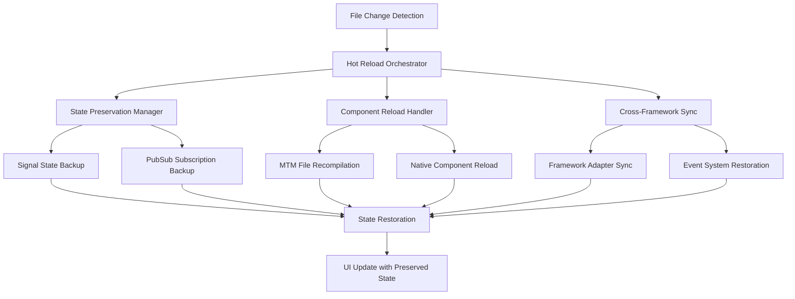

# Hot Reload Support Design

## Overview

This design enhances the existing Metamon hot reload capabilities to provide seamless development experience for .mtm files, native framework components, and cross-framework state management. The solution builds upon the current Vite-based HMR system and extends it with Metamon-specific features for state preservation and cross-framework communication.

The design focuses on three core areas:
1. Enhanced .mtm file hot reload with state preservation
2. Native framework component hot reload with Metamon adapter integration
3. Cross-framework state and event system preservation during reloads

## Architecture

### Current System Analysis

The existing system includes:
- **Vite Plugin MTM** (`vite-plugin-mtm.ts`): Handles .mtm file compilation and basic HMR
- **File Watcher** (`file-watcher.ts`): Monitors file changes for .mtm and related files
- **Signal Manager** (`signal-manager.ts`): Manages cross-framework state with global signals
- **MTM Compiler**: Compiles .mtm files to framework-specific code

### Enhanced Hot Reload Architecture



## Components and Interfaces

### 1. Hot Reload Orchestrator

**Purpose**: Central coordinator for all hot reload operations

```typescript
interface HotReloadOrchestrator {
  // Core reload coordination
  handleFileChange(filePath: string, changeType: 'mtm' | 'native' | 'dependency'): Promise<void>;
  
  // State management during reload
  preserveState(): StateSnapshot;
  restoreState(snapshot: StateSnapshot): void;
  
  // Cross-framework coordination
  syncFrameworks(): Promise<void>;
  
  // Error handling and recovery
  handleReloadError(error: ReloadError): void;
}
```

### 2. State Preservation Manager

**Purpose**: Backup and restore Metamon signals and PubSub subscriptions

```typescript
interface StatePreservationManager {
  // Signal state management
  backupSignalState(): SignalStateSnapshot;
  restoreSignalState(snapshot: SignalStateSnapshot): void;
  
  // PubSub subscription management
  backupSubscriptions(): SubscriptionSnapshot;
  restoreSubscriptions(snapshot: SubscriptionSnapshot): void;
  
  // Component-specific state
  backupComponentState(componentId: string): ComponentStateSnapshot;
  restoreComponentState(componentId: string, snapshot: ComponentStateSnapshot): void;
}
```

### 3. Enhanced MTM Plugin

**Purpose**: Extended Vite plugin with advanced hot reload capabilities

```typescript
interface EnhancedMTMPlugin extends MTMPluginOptions {
  // State preservation options
  preserveSignals?: boolean;
  preserveSubscriptions?: boolean;
  preserveComponentState?: boolean;
  
  // Cross-framework sync options
  syncFrameworks?: boolean;
  syncTimeout?: number;
  
  // Error handling options
  showErrorOverlay?: boolean;
  errorRecoveryMode?: 'graceful' | 'strict';
  
  // Performance options
  batchUpdates?: boolean;
  debounceMs?: number;
}
```

### 4. Framework Adapter Integration

**Purpose**: Ensure native framework components work seamlessly with hot reload

```typescript
interface FrameworkHotReloadAdapter {
  // Framework-specific hot reload handling
  handleComponentReload(componentPath: string): Promise<void>;
  
  // State preservation for framework-specific state
  preserveFrameworkState(componentId: string): any;
  restoreFrameworkState(componentId: string, state: any): void;
  
  // Metamon adapter integration
  reconnectMetamonAdapters(): void;
  validateAdapterConnections(): boolean;
}
```

## Data Models

### State Snapshots

```typescript
interface StateSnapshot {
  signals: SignalStateSnapshot;
  subscriptions: SubscriptionSnapshot;
  components: Map<string, ComponentStateSnapshot>;
  timestamp: number;
}

interface SignalStateSnapshot {
  globalSignals: Map<string, any>;
  signalSubscriptions: Map<string, string[]>;
}

interface SubscriptionSnapshot {
  eventSubscriptions: Map<string, EventSubscription[]>;
  activeChannels: Map<string, ChannelConfig>;
}

interface ComponentStateSnapshot {
  componentId: string;
  frameworkType: string;
  localState: any;
  props: any;
  metamonConnections: MetamonConnection[];
}
```

### Hot Reload Configuration

```typescript
interface HotReloadConfig {
  // File watching configuration
  watchPatterns: string[];
  ignorePatterns: string[];
  
  // Reload behavior
  preserveState: boolean;
  batchUpdates: boolean;
  debounceMs: number;
  
  // Cross-framework settings
  syncFrameworks: boolean;
  syncTimeout: number;
  
  // Error handling
  showErrorOverlay: boolean;
  errorRecoveryMode: 'graceful' | 'strict';
  
  // Performance settings
  maxConcurrentReloads: number;
  reloadTimeout: number;
}
```

## Error Handling

### Error Recovery Strategy

1. **Graceful Degradation**: When compilation errors occur, show error overlay while preserving application state
2. **State Recovery**: If state restoration fails, attempt partial recovery with user notification
3. **Framework Isolation**: Errors in one framework component shouldn't break others
4. **Rollback Capability**: Ability to rollback to last working state if reload fails completely

### Error Types and Handling

```typescript
enum ReloadErrorType {
  COMPILATION_ERROR = 'compilation_error',
  STATE_PRESERVATION_ERROR = 'state_preservation_error',
  FRAMEWORK_SYNC_ERROR = 'framework_sync_error',
  TIMEOUT_ERROR = 'timeout_error'
}

interface ReloadError {
  type: ReloadErrorType;
  filePath: string;
  message: string;
  stack?: string;
  recoverable: boolean;
}
```

## Testing Strategy

### Unit Testing

1. **State Preservation Tests**
   - Signal state backup and restoration
   - PubSub subscription preservation
   - Component state isolation

2. **Hot Reload Logic Tests**
   - File change detection and handling
   - Cross-framework synchronization
   - Error recovery mechanisms

3. **Framework Integration Tests**
   - React component hot reload with Metamon adapters
   - Vue component hot reload with signal preservation
   - Svelte component hot reload with store integration
   - Solid component hot reload with signal connections

### Integration Testing

1. **End-to-End Hot Reload Scenarios**
   - Modify .mtm file and verify state preservation
   - Change native framework component and verify cross-framework communication
   - Test error scenarios and recovery

2. **Performance Testing**
   - Hot reload speed benchmarks
   - Memory usage during state preservation
   - Concurrent reload handling

3. **Cross-Framework Communication Testing**
   - Signal updates during hot reload
   - Event emission and subscription preservation
   - Framework adapter reconnection

### Development Testing Setup

```typescript
// Test utilities for hot reload development
interface HotReloadTestUtils {
  // Simulate file changes
  simulateFileChange(filePath: string, content: string): Promise<void>;
  
  // State verification
  verifyStatePreservation(beforeSnapshot: StateSnapshot, afterSnapshot: StateSnapshot): boolean;
  
  // Performance measurement
  measureReloadTime(filePath: string): Promise<number>;
  
  // Error simulation
  simulateCompilationError(filePath: string, errorType: string): Promise<void>;
}
```

## Implementation Plan Integration

This design provides the foundation for implementing hot reload support through the following key enhancements:

1. **Enhanced Vite Plugin**: Extend the existing `vite-plugin-mtm.ts` with state preservation capabilities
2. **State Management Integration**: Integrate with the existing `MetamonSignalManager` for state backup/restore
3. **Framework Adapter Updates**: Enhance framework adapters to support hot reload state preservation
4. **Error Handling Enhancement**: Improve error display and recovery mechanisms
5. **Performance Optimization**: Implement batching and debouncing for efficient reloads

The design leverages the existing architecture while adding the necessary components for comprehensive hot reload support that maintains the integrity of Metamon's cross-framework state management system.