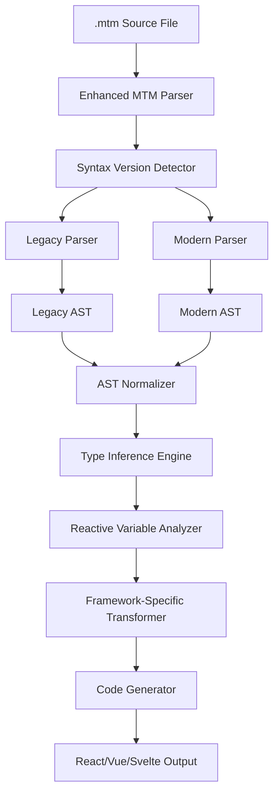
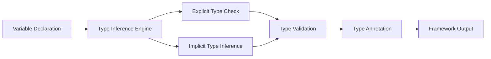
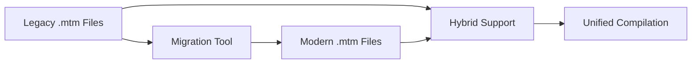

# Design Document

## Overview

The MTM Syntax Evolution feature will modernize the MetaMon (.mtm) language by introducing a cleaner, more intuitive syntax that leverages the $ prefix for variables and functions, reactive programming with the ! suffix, and enhanced type inference. This design builds upon the existing MTM compilation architecture while introducing new parsing and transformation capabilities to support the evolved syntax.

The design maintains backward compatibility with the current MTM syntax while providing a migration path to the new syntax. The compiler will detect which syntax version is being used and apply the appropriate parsing and transformation rules.

## Architecture

### High-Level Architecture



### Parser Architecture

The enhanced parser will support both legacy and modern syntax through a two-stage parsing approach:

1. **Syntax Detection Stage**: Analyze the file to determine syntax version
2. **Parsing Stage**: Use appropriate parser based on detected version
3. **Normalization Stage**: Convert both syntax versions to a unified AST

### Type System Architecture



## Components and Interfaces

### Enhanced MTM Parser

```typescript
interface EnhancedMTMParser {
  parse(content: string, filePath: string): MTMFile;
  detectSyntaxVersion(content: string): 'legacy' | 'modern';
  parseLegacy(content: string): LegacyAST;
  parseModern(content: string): ModernAST;
  normalizeAST(ast: LegacyAST | ModernAST): UnifiedAST;
}

interface ModernSyntaxFeatures {
  dollarPrefixVariables: boolean;
  reactiveVariables: boolean;
  enhancedTypeInference: boolean;
  optionalSemicolons: boolean;
  autoThisBinding: boolean;
}
```

### Variable Declaration System

```typescript
interface VariableDeclaration {
  name: string;
  prefix: '$' | null;
  type: TypeAnnotation | null;
  value: Expression;
  isReactive: boolean; // true if ends with !
  inferredType: TypeInfo;
  scope: 'local' | 'global';
}

interface ReactiveVariable extends VariableDeclaration {
  isReactive: true;
  updateTriggers: string[]; // UI elements that should update
  dependencies: string[]; // other variables this depends on
}
```

### Type Inference Engine

```typescript
interface TypeInferenceEngine {
  inferType(value: Expression, context: InferenceContext): TypeInfo;
  validateExplicitType(declared: TypeAnnotation, inferred: TypeInfo): ValidationResult;
  resolveTypeConflicts(types: TypeInfo[]): TypeInfo;
  generateTypeHints(variable: VariableDeclaration): TypeHint[];
}

interface TypeInfo {
  baseType: 'string' | 'number' | 'boolean' | 'object' | 'array' | 'function' | 'float';
  nullable: boolean;
  generic?: TypeInfo[];
  properties?: Record<string, TypeInfo>;
}
```

### Reactive System

```typescript
interface ReactiveSystem {
  analyzeReactiveVariables(ast: UnifiedAST): ReactiveGraph;
  generateUpdateTriggers(variable: ReactiveVariable): UpdateTrigger[];
  optimizeBatchUpdates(triggers: UpdateTrigger[]): BatchedUpdate[];
  generateFrameworkBindings(reactive: ReactiveVariable, target: FrameworkTarget): BindingCode;
}

interface ReactiveGraph {
  variables: Map<string, ReactiveVariable>;
  dependencies: Map<string, string[]>;
  updateChains: UpdateChain[];
}
```

### Template System

```typescript
interface TemplateProcessor {
  parseTemplate(template: string): TemplateAST;
  extractBindings(ast: TemplateAST): DataBinding[];
  generateFrameworkTemplate(ast: TemplateAST, target: FrameworkTarget): string;
  optimizeBindings(bindings: DataBinding[]): OptimizedBinding[];
}

interface DataBinding {
  type: 'variable' | 'expression' | 'event';
  source: string;
  target: DOMElement;
  isReactive: boolean;
  updateStrategy: 'immediate' | 'batched' | 'debounced';
}
```

## Data Models

### Modern Syntax AST Nodes

```typescript
interface ModernVariableNode {
  type: 'VariableDeclaration';
  name: string;
  hasDollarPrefix: boolean;
  hasReactiveSuffix: boolean;
  typeAnnotation?: TypeAnnotationNode;
  initializer: ExpressionNode;
  location: SourceLocation;
}

interface ModernFunctionNode {
  type: 'FunctionDeclaration';
  name: string;
  hasDollarPrefix: boolean;
  parameters: ParameterNode[];
  returnType?: TypeAnnotationNode;
  body: BlockStatementNode;
  isArrow: boolean;
  autoBindThis: boolean;
}

interface ModernClassNode {
  type: 'ClassDeclaration';
  name: string;
  properties: ClassPropertyNode[];
  methods: ClassMethodNode[];
  constructor?: ConstructorNode;
}

interface ClassPropertyNode {
  name: string;
  hasDollarPrefix: boolean;
  typeAnnotation?: TypeAnnotationNode;
  initializer?: ExpressionNode;
  isReactive: boolean;
}
```

### Type System Models

```typescript
interface TypeAnnotationNode {
  type: 'TypeAnnotation';
  typeKind: 'primitive' | 'object' | 'array' | 'function' | 'generic';
  baseType: string;
  generics?: TypeAnnotationNode[];
  properties?: Record<string, TypeAnnotationNode>;
  parameters?: TypeAnnotationNode[];
  returnType?: TypeAnnotationNode;
}

interface InferenceContext {
  scope: Scope;
  availableTypes: Map<string, TypeInfo>;
  frameworkTarget: FrameworkTarget;
  strictMode: boolean;
}
```

## Error Handling

### Syntax Error Categories

```typescript
enum ModernSyntaxErrorType {
  INVALID_DOLLAR_PREFIX = 'invalid_dollar_prefix',
  REACTIVE_SYNTAX_ERROR = 'reactive_syntax_error',
  TYPE_ANNOTATION_ERROR = 'type_annotation_error',
  AUTO_SEMICOLON_AMBIGUITY = 'auto_semicolon_ambiguity',
  THIS_BINDING_ERROR = 'this_binding_error'
}

interface SyntaxErrorHandler {
  categorizeError(error: Error, context: ParseContext): CategorizedError;
  generateSuggestion(error: CategorizedError): string;
  provideQuickFix(error: CategorizedError): QuickFix[];
}
```

### Type Error Handling

```typescript
interface TypeErrorHandler {
  handleInferenceFailure(variable: VariableDeclaration): TypeErrorRecovery;
  handleTypeConflict(declared: TypeInfo, inferred: TypeInfo): ConflictResolution;
  generateTypeHints(context: InferenceContext): TypeHint[];
}

interface TypeErrorRecovery {
  fallbackType: TypeInfo;
  suggestions: string[];
  requiresExplicitType: boolean;
}
```

## Testing Strategy

### Unit Testing

1. **Parser Testing**
   - Test modern syntax parsing for all new constructs
   - Test backward compatibility with legacy syntax
   - Test error recovery and reporting
   - Test AST normalization between syntax versions

2. **Type Inference Testing**
   - Test automatic type inference for various value types
   - Test explicit type annotation validation
   - Test type conflict resolution
   - Test edge cases and complex type scenarios

3. **Reactive System Testing**
   - Test reactive variable detection and analysis
   - Test dependency graph generation
   - Test update trigger optimization
   - Test framework-specific binding generation

### Integration Testing

1. **End-to-End Compilation Testing**
   - Test complete compilation pipeline from modern syntax to framework output
   - Test hot reload functionality with new syntax
   - Test error overlay integration
   - Test source map generation

2. **Framework Compatibility Testing**
   - Test React output generation and functionality
   - Test Vue output generation and functionality
   - Test Svelte output generation and functionality
   - Test cross-framework state synchronization

### Performance Testing

1. **Parser Performance**
   - Benchmark parsing speed for large files
   - Test memory usage during parsing
   - Compare performance between legacy and modern syntax

2. **Type Inference Performance**
   - Benchmark type inference for complex scenarios
   - Test incremental type checking performance
   - Measure impact on compilation time

## Framework-Specific Transformations

### React Transformations

```typescript
interface ReactTransformer {
  transformReactiveVariable(variable: ReactiveVariable): ReactHookCode;
  transformDollarFunction(func: ModernFunctionNode): ReactComponentCode;
  transformTemplate(template: TemplateAST): JSXCode;
  generateStateManagement(reactives: ReactiveVariable[]): ReactStateCode;
}

// Example transformation:
// $counter! = 0 → const [counter, setCounter] = useState(0);
// $increment = () => $counter++ → const increment = useCallback(() => setCounter(prev => prev + 1), []);
```

### Vue Transformations

```typescript
interface VueTransformer {
  transformReactiveVariable(variable: ReactiveVariable): VueRefCode;
  transformDollarFunction(func: ModernFunctionNode): VueMethodCode;
  transformTemplate(template: TemplateAST): VueTemplateCode;
  generateCompositionAPI(reactives: ReactiveVariable[]): VueSetupCode;
}

// Example transformation:
// $counter! = 0 → const counter = ref(0);
// $increment = () => $counter++ → const increment = () => { counter.value++; };
```

### Svelte Transformations

```typescript
interface SvelteTransformer {
  transformReactiveVariable(variable: ReactiveVariable): SvelteStoreCode;
  transformDollarFunction(func: ModernFunctionNode): SvelteFunctionCode;
  transformTemplate(template: TemplateAST): SvelteMarkupCode;
  generateReactiveStatements(reactives: ReactiveVariable[]): SvelteReactiveCode;
}

// Example transformation:
// $counter! = 0 → let counter = 0; (with reactive: $: statements)
// $increment = () => $counter++ → function increment() { counter++; }
```

## Migration Strategy

### Backward Compatibility

1. **Dual Parser Support**: Maintain both legacy and modern parsers
2. **Gradual Migration**: Allow mixing of syntax styles within projects
3. **Migration Tools**: Provide automated migration utilities
4. **Documentation**: Comprehensive migration guides and examples

### Migration Path



### Migration Utilities

```typescript
interface MigrationTool {
  analyzeLegacySyntax(file: string): MigrationAnalysis;
  generateModernEquivalent(legacy: LegacyAST): ModernAST;
  createMigrationReport(analysis: MigrationAnalysis): MigrationReport;
  applyAutomaticMigration(file: string): MigrationResult;
}
```

## Performance Optimizations

### Compilation Performance

1. **Incremental Parsing**: Only reparse changed sections
2. **AST Caching**: Cache parsed ASTs for unchanged files
3. **Type Inference Caching**: Cache inferred types
4. **Parallel Processing**: Process multiple files concurrently

### Runtime Performance

1. **Reactive Optimization**: Minimize unnecessary updates
2. **Bundle Splitting**: Separate reactive system code
3. **Tree Shaking**: Remove unused syntax features
4. **Code Generation**: Optimize generated framework code

### Memory Management

1. **AST Cleanup**: Dispose of unused AST nodes
2. **Type Cache Management**: Limit type cache size
3. **Reactive Graph Optimization**: Minimize dependency tracking overhead

This design provides a comprehensive foundation for implementing the MTM syntax evolution while maintaining compatibility with existing code and ensuring optimal performance across all supported frameworks.