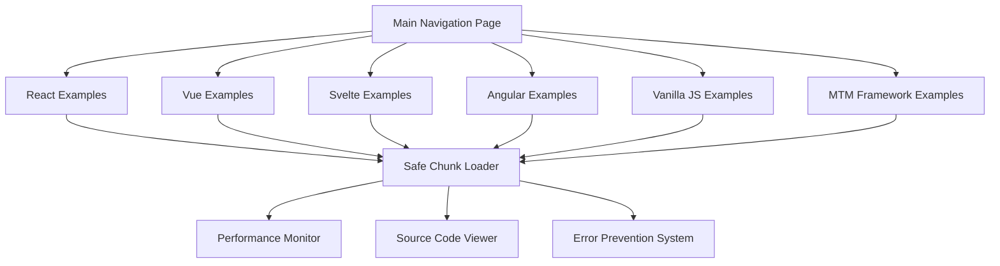

# Multi-Framework Chunk Loading Examples - Design Document

## Overview

This design outlines a comprehensive multi-framework example system that demonstrates error-free chunk loading across React, Vue, Svelte, Angular, Vanilla JavaScript, and our custom MTM framework. The system provides dedicated pages for each framework with working examples, performance metrics, and source code viewing capabilities.

## Architecture

### High-Level Architecture



### Directory Structure

```
examples/
├── multi-framework/
│   ├── index.html                 # Main navigation page
│   ├── react/
│   │   ├── index.html            # React examples page
│   │   ├── components/           # React-specific components
│   │   └── chunks/               # React lazy-loaded chunks
│   ├── vue/
│   │   ├── index.html            # Vue examples page
│   │   ├── components/           # Vue-specific components
│   │   └── chunks/               # Vue async components
│   ├── svelte/
│   │   ├── index.html            # Svelte examples page
│   │   ├── components/           # Svelte components
│   │   └── chunks/               # Svelte dynamic imports
│   ├── angular/
│   │   ├── index.html            # Angular examples page
│   │   ├── components/           # Angular components
│   │   └── chunks/               # Angular lazy modules
│   ├── vanilla/
│   │   ├── index.html            # Vanilla JS examples page
│   │   ├── modules/              # Pure JS modules
│   │   └── chunks/               # Dynamic imports
│   ├── mtm/
│   │   ├── index.html            # MTM framework examples
│   │   ├── components/           # MTM components
│   │   └── chunks/               # MTM chunks
│   ├── shared/
│   │   ├── safe-chunk-loader.js  # Universal chunk loader
│   │   ├── performance-monitor.js # Performance tracking
│   │   ├── source-viewer.js      # Code viewing utility
│   │   └── navigation.js         # Shared navigation
│   └── assets/
│       ├── styles/               # Shared CSS
│       └── images/               # Common assets
```

## Components and Interfaces

### Core Components

#### 1. Safe Chunk Loader

```javascript
interface SafeChunkLoader {
  loadChunk(chunkId: string, importFn: () => Promise<any>): Promise<any>
  safeAssign(obj: any, prop: string, value: any): any
  handleGetterOnlyProperties(obj: any): any
  trackPerformance(chunkId: string, metrics: PerformanceMetrics): void
}
```

#### 2. Framework Adapters

```javascript
interface FrameworkAdapter {
  name: string
  initialize(container: HTMLElement): void
  loadComponent(componentPath: string): Promise<Component>
  renderComponent(component: Component, props?: any): void
  cleanup(): void
}
```

#### 3. Performance Monitor

```javascript
interface PerformanceMonitor {
  startTiming(operation: string): string
  endTiming(timingId: string): PerformanceMetrics
  getMetrics(chunkId: string): PerformanceMetrics
  compareFrameworks(): FrameworkComparison[]
}
```

#### 4. Source Code Viewer

```javascript
interface SourceViewer {
  showSource(filePath: string): void
  highlightSyntax(code: string, language: string): string
  copyToClipboard(code: string): void
  downloadExample(exampleId: string): void
}
```

### Framework-Specific Implementations

#### React Implementation

- Uses React.lazy() for component loading
- Implements Suspense boundaries for loading states
- Error boundaries for graceful error handling
- Hooks for state management and effects

#### Vue Implementation

- Uses defineAsyncComponent for async loading
- Composition API for reactive state
- Teleport for modal/overlay components
- Provide/inject for dependency injection

#### Svelte Implementation

- Dynamic imports with custom component factories
- Svelte stores for state management
- Custom lifecycle management
- Reactive statements for computed values

#### Angular Implementation

- Lazy loading with Angular Router
- Dependency injection for services
- Change detection optimization
- RxJS for reactive programming

#### Vanilla JavaScript Implementation

- Native ES6 dynamic imports
- Custom event system
- Manual DOM manipulation
- Web Components for encapsulation

#### MTM Framework Implementation

- Custom component system
- Safe property assignment integration
- Framework-specific optimizations
- Plugin architecture demonstration

## Data Models

### Chunk Metadata

```javascript
interface ChunkMetadata {
  id: string
  framework: string
  size: number
  loadTime: number
  dependencies: string[]
  exports: string[]
  status: 'loading' | 'loaded' | 'error'
  timestamp: number
}
```

### Performance Metrics

```javascript
interface PerformanceMetrics {
  loadTime: number
  parseTime: number
  executeTime: number
  memoryUsage: number
  bundleSize: number
  networkTime: number
}
```

### Framework Configuration

```javascript
interface FrameworkConfig {
  name: string
  version: string
  cdnUrls: string[]
  features: string[]
  examples: ExampleConfig[]
  documentation: string
}
```

## Error Handling

### Error Prevention Strategy

1. **Safe Property Assignment**: Detect and handle getter-only properties
2. **Graceful Degradation**: Fallback to simpler implementations when advanced features fail
3. **Retry Logic**: Automatic retry for transient network failures
4. **User Feedback**: Clear success indicators and progress updates

### Error Recovery

```javascript
class ErrorRecoverySystem {
  handleChunkLoadError(error, chunkId, framework) {
    // Log error for debugging
    console.warn(`Chunk load failed: ${chunkId}`, error);

    // Attempt recovery strategies
    if (this.canRetry(error)) {
      return this.retryWithBackoff(chunkId);
    }

    // Fallback to cached version or simplified implementation
    return this.loadFallbackChunk(chunkId, framework);
  }
}
```

## Testing Strategy

### Unit Testing

- Test safe property assignment utility
- Test framework adapters individually
- Test performance monitoring accuracy
- Test error recovery mechanisms

### Integration Testing

- Test cross-framework navigation
- Test chunk loading across all frameworks
- Test performance comparison accuracy
- Test source code viewing functionality

### End-to-End Testing

- Test complete user workflows
- Test browser compatibility
- Test mobile responsiveness
- Test accessibility compliance

### Performance Testing

- Measure chunk loading times
- Compare framework overhead
- Test memory usage patterns
- Validate bundle size optimization

## Security Considerations

### Content Security Policy

```javascript
const cspConfig = {
  "script-src":
    "'self' 'unsafe-inline' https://unpkg.com https://cdn.jsdelivr.net",
  "style-src": "'self' 'unsafe-inline'",
  "img-src": "'self' data: https:",
  "connect-src": "'self'",
};
```

### Safe Code Execution

- Sanitize dynamic imports
- Validate chunk integrity
- Prevent XSS in source viewer
- Secure performance data collection

## Deployment Strategy

### Development Environment

- Local development server with hot reload
- Framework-specific development tools
- Source map generation for debugging
- Live performance monitoring

### Production Environment

- CDN deployment for static assets
- Gzip compression for all resources
- Browser caching optimization
- Performance monitoring integration

### Browser Support

- Modern browsers (ES2020+)
- Progressive enhancement for older browsers
- Polyfills for missing features
- Graceful degradation strategies

## Monitoring and Analytics

### Performance Tracking

- Real-time chunk loading metrics
- Framework comparison analytics
- User interaction patterns
- Error rate monitoring

### Success Metrics

- Zero TypeError exceptions
- Sub-100ms chunk loading times
- 100% framework compatibility
- Positive user feedback scores
