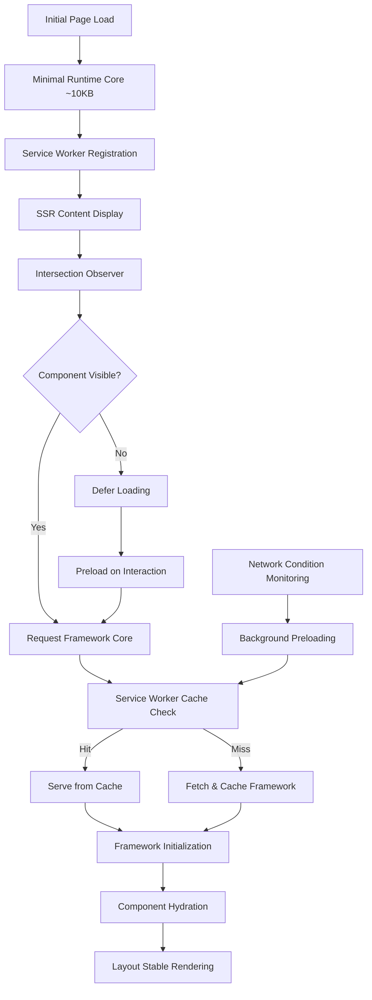

# Performance Optimization Design

## Overview

This design implements a comprehensive performance optimization strategy for the Metamon framework that addresses the critical bottleneck of loading multiple framework cores upfront. The solution leverages service workers, intelligent lazy loading, SSR optimization, and layout shift prevention to dramatically improve Core Web Vitals and user experience.

The design focuses on four core architectural pillars:
1. **Service Worker-Based Framework Loading**: On-demand delivery of framework cores through cached service worker responses
2. **Selective SSR and Hydration**: Server-side rendering with intelligent client-side hydration only where needed
3. **Layout Stability**: Preventing cumulative layout shift during asynchronous loading
4. **Progressive Enhancement**: Ensuring functionality across all browser capabilities and network conditions

## Architecture

### Current Performance Issues

The existing system has several performance bottlenecks:
- **Bundle Size**: All framework cores (React, Vue, Svelte, Solid) loaded upfront (~200KB+ initial bundle)
- **Main Thread Blocking**: Framework initialization blocks UI responsiveness
- **Poor Cache Utilization**: Monolithic bundles prevent efficient caching
- **Layout Shifts**: Components loading asynchronously cause visual instability
- **No SSR Optimization**: Server-rendered content still requires full client-side framework loading

### Optimized Architecture



## Components and Interfaces

### 1. Framework Loader Service

**Purpose**: Orchestrates on-demand loading of framework cores through service workers

```typescript
interface FrameworkLoaderService {
  // Core loading methods
  loadFramework(framework: FrameworkType, priority: LoadPriority): Promise<FrameworkCore>;
  preloadFramework(framework: FrameworkType): Promise<void>;
  
  // Cache management
  getCachedFrameworks(): FrameworkType[];
  invalidateFrameworkCache(framework: FrameworkType): Promise<void>;
  
  // Performance monitoring
  getLoadingMetrics(): FrameworkLoadingMetrics;
  
  // Network adaptation
  adaptToNetworkConditions(conditions: NetworkConditions): void;
}

enum LoadPriority {
  CRITICAL = 'critical',    // Visible components
  HIGH = 'high',           // Above fold
  NORMAL = 'normal',       // Below fold
  LOW = 'low'              // Preload
}

interface FrameworkCore {
  name: FrameworkType;
  version: string;
  bundle: ArrayBuffer;
  dependencies: string[];
  size: number;
}
```

### 2. Service Worker Framework Manager

**Purpose**: Handles framework caching, delivery, and execution offloading in service worker context

```typescript
interface ServiceWorkerFrameworkManager {
  // Framework delivery
  handleFrameworkRequest(request: FrameworkRequest): Promise<Response>;
  
  // Cache management
  cacheFramework(framework: FrameworkCore): Promise<void>;
  getCachedFramework(name: FrameworkType): Promise<FrameworkCore | null>;
  
  // Background execution
  executeInBackground(task: BackgroundTask): Promise<any>;
  
  // Cache invalidation
  invalidateCache(pattern: string): Promise<void>;
  updateFrameworkCache(updates: FrameworkUpdate[]): Promise<void>;
}

interface FrameworkRequest {
  framework: FrameworkType;
  version: string;
  priority: LoadPriority;
  clientId: string;
}

interface BackgroundTask {
  type: 'state-computation' | 'data-processing' | 'component-preparation';
  payload: any;
  timeout: number;
}
```

### 3. SSR Optimization Manager

**Purpose**: Manages server-side rendering with selective client-side hydration

```typescript
interface SSROptimizationManager {
  // SSR content management
  renderServerContent(components: ComponentDefinition[]): Promise<SSRResult>;
  
  // Selective hydration
  identifyHydrationTargets(ssrContent: string): HydrationTarget[];
  hydrateComponent(target: HydrationTarget): Promise<void>;
  
  // Framework requirement analysis
  analyzeFrameworkRequirements(components: ComponentDefinition[]): FrameworkRequirement[];
  
  // Progressive enhancement
  enableProgressiveEnhancement(fallbackStrategy: FallbackStrategy): void;
}

interface SSRResult {
  html: string;
  criticalCSS: string;
  hydrationData: HydrationData;
  frameworkRequirements: FrameworkRequirement[];
}

interface HydrationTarget {
  componentId: string;
  framework: FrameworkType;
  isInteractive: boolean;
  priority: LoadPriority;
  boundingRect: DOMRect;
}

interface FrameworkRequirement {
  framework: FrameworkType;
  components: string[];
  priority: LoadPriority;
  estimatedSize: number;
}
```

### 4. Layout Stability Controller

**Purpose**: Prevents layout shifts during asynchronous framework loading and component hydration

```typescript
interface LayoutStabilityController {
  // Layout preservation
  preserveLayout(element: HTMLElement): LayoutReservation;
  releaseLayout(reservation: LayoutReservation): void;
  
  // Placeholder management
  createPlaceholder(component: ComponentDefinition): HTMLElement;
  replacePlaceholder(placeholder: HTMLElement, component: HTMLElement): void;
  
  // Transition management
  createSeamlessTransition(from: HTMLElement, to: HTMLElement): Promise<void>;
  
  // CLS monitoring
  measureLayoutShift(): CLSMetrics;
  optimizeForCLS(threshold: number): void;
}

interface LayoutReservation {
  id: string;
  element: HTMLElement;
  dimensions: DOMRect;
  placeholder: HTMLElement;
  expiresAt: number;
}

interface CLSMetrics {
  score: number;
  shifts: LayoutShift[];
  worstShift: LayoutShift;
  timeline: CLSTimelineEntry[];
}
```

### 5. Intelligent Preloader

**Purpose**: Implements smart preloading strategies based on user behavior and viewport visibility

```typescript
interface IntelligentPreloader {
  // Viewport-based preloading
  observeViewport(components: ComponentDefinition[]): void;
  
  // Interaction-based preloading
  predictUserIntent(interactions: UserInteraction[]): PreloadPrediction[];
  
  // Navigation-based preloading
  preloadForNavigation(route: string): Promise<void>;
  
  // Network-aware preloading
  adaptPreloadingStrategy(networkConditions: NetworkConditions): void;
  
  // Preload management
  schedulePreload(framework: FrameworkType, priority: LoadPriority): void;
  cancelPreload(framework: FrameworkType): void;
}

interface PreloadPrediction {
  framework: FrameworkType;
  confidence: number;
  reason: 'viewport' | 'interaction' | 'navigation' | 'pattern';
  priority: LoadPriority;
}

interface NetworkConditions {
  effectiveType: '2g' | '3g' | '4g';
  downlink: number;
  rtt: number;
  saveData: boolean;
}
```

## Data Models

### Framework Bundle Structure

```typescript
interface FrameworkBundle {
  // Core framework files
  core: {
    runtime: ArrayBuffer;
    adapters: ArrayBuffer;
    utilities: ArrayBuffer;
  };
  
  // Dependency information
  dependencies: {
    shared: string[];
    framework: string[];
    version: string;
  };
  
  // Caching metadata
  metadata: {
    version: string;
    size: number;
    checksum: string;
    buildTime: number;
    expiresAt: number;
  };
  
  // Loading configuration
  loading: {
    priority: LoadPriority;
    preloadTriggers: PreloadTrigger[];
    fallbackStrategy: FallbackStrategy;
  };
}

interface PreloadTrigger {
  type: 'viewport' | 'interaction' | 'idle' | 'navigation';
  threshold: number;
  delay: number;
}
```

### Performance Metrics

```typescript
interface PerformanceMetrics {
  // Loading performance
  loading: {
    initialBundleSize: number;
    frameworkLoadTimes: Map<FrameworkType, number>;
    cacheHitRate: number;
    totalLoadTime: number;
  };
  
  // Core Web Vitals
  webVitals: {
    lcp: number;  // Largest Contentful Paint
    fid: number;  // First Input Delay
    cls: number;  // Cumulative Layout Shift
    fcp: number;  // First Contentful Paint
    ttfb: number; // Time to First Byte
  };
  
  // Service Worker performance
  serviceWorker: {
    registrationTime: number;
    cacheOperationTimes: Map<string, number>;
    backgroundTaskTimes: Map<string, number>;
    errorRate: number;
  };
  
  // Network efficiency
  network: {
    bytesTransferred: number;
    requestCount: number;
    cacheUtilization: number;
    compressionRatio: number;
  };
}
```

## Error Handling

### Progressive Degradation Strategy

```typescript
interface ProgressiveDegradationStrategy {
  // Service worker fallbacks
  handleServiceWorkerFailure(): FallbackAction;
  
  // Framework loading fallbacks
  handleFrameworkLoadFailure(framework: FrameworkType): FallbackAction;
  
  // Network failure handling
  handleNetworkFailure(request: FrameworkRequest): FallbackAction;
  
  // Cache corruption handling
  handleCacheCorruption(): Promise<void>;
}

enum FallbackAction {
  DIRECT_LOAD = 'direct_load',
  CACHED_VERSION = 'cached_version',
  MINIMAL_FALLBACK = 'minimal_fallback',
  GRACEFUL_DEGRADATION = 'graceful_degradation'
}
```

### Error Recovery Mechanisms

1. **Service Worker Unavailable**: Direct framework loading with reduced caching
2. **Framework Load Failure**: Fallback to cached version or minimal functionality
3. **Network Failure**: Offline-first approach with cached resources
4. **Cache Corruption**: Automatic cache invalidation and rebuild
5. **Hydration Failure**: Server-rendered content remains functional

## Testing Strategy

### Performance Testing

1. **Bundle Size Analysis**
   - Initial bundle size measurement
   - Framework loading impact analysis
   - Cache efficiency testing

2. **Core Web Vitals Testing**
   - LCP optimization validation
   - CLS prevention testing
   - FID improvement measurement

3. **Service Worker Testing**
   - Cache performance testing
   - Background task execution testing
   - Fallback mechanism validation

### Load Testing

1. **Concurrent Framework Loading**
   - Multiple framework simultaneous loading
   - Service worker performance under load
   - Cache contention testing

2. **Network Condition Simulation**
   - Slow network performance testing
   - Intermittent connectivity testing
   - Bandwidth limitation testing

### Integration Testing

1. **SSR Integration**
   - Server-side rendering with lazy loading
   - Hydration performance testing
   - SEO impact validation

2. **Cross-Framework Compatibility**
   - Multiple frameworks on single page
   - Framework interaction testing
   - State management during lazy loading

## Implementation Phases

### Phase 1: Service Worker Foundation
- Service worker registration and basic caching
- Framework bundle splitting and optimization
- Basic lazy loading implementation

### Phase 2: SSR Integration
- Server-side rendering optimization
- Selective hydration implementation
- Layout stability improvements

### Phase 3: Intelligent Loading
- Viewport-based preloading
- User interaction prediction
- Network-aware optimization

### Phase 4: Performance Monitoring
- Comprehensive metrics collection
- Performance debugging tools
- Optimization recommendations

This design provides a comprehensive approach to solving the framework loading performance bottleneck while maintaining the flexibility and functionality of the Metamon multi-framework system.