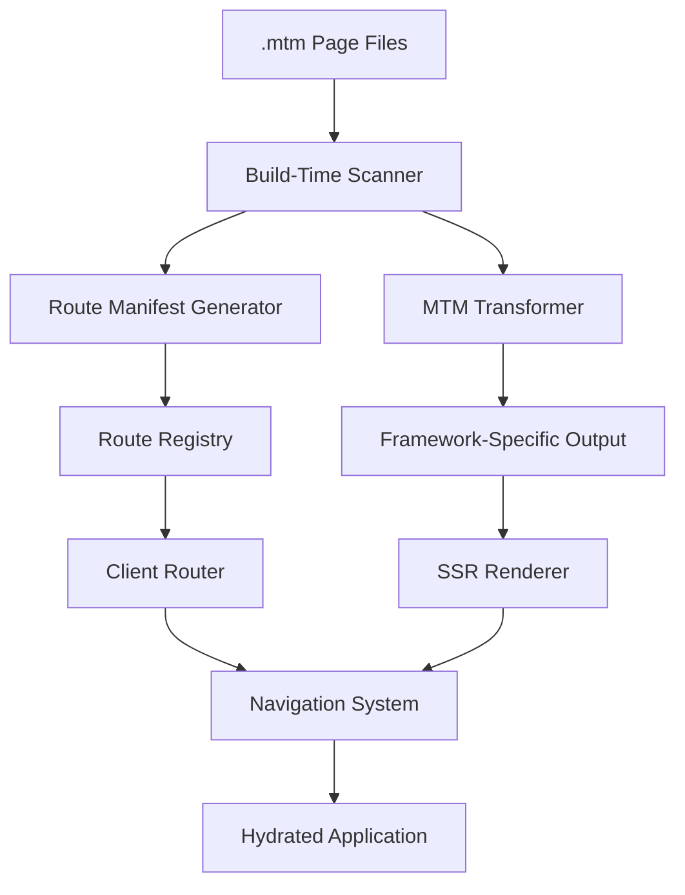
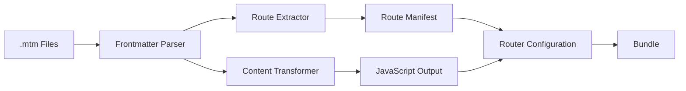

# Design Document

## Overview

The Ultra-Modern MTM Routing and Build System will solve the current Vite import analysis issues by implementing a build-time route generation system, proper plugin integration, and seamless client-side navigation. The design focuses on transforming .mtm files before any import analysis, generating route manifests at build time, and providing robust SSR support with progressive hydration.

## Architecture

### High-Level Architecture



### Build-Time Processing Pipeline



## Components and Interfaces

### Enhanced MTM Plugin

```typescript
interface EnhancedMTMPlugin {
  name: string;
  enforce: "pre";
  buildStart(): void;
  transform(code: string, id: string): TransformResult;
  generateBundle(): void;
  configureServer(server: ViteDevServer): void;
}

interface TransformResult {
  code: string;
  map?: SourceMap;
  dependencies?: string[];
}
```

### Build-Time Route Scanner

```typescript
interface RouteScanner {
  scanPages(pagesDir: string): Promise<PageInfo[]>;
  watchPages(pagesDir: string, callback: (pages: PageInfo[]) => void): void;
  generateRouteManifest(pages: PageInfo[]): RouteManifest;
}

interface PageInfo {
  filePath: string;
  route: string;
  title: string;
  description: string;
  keywords: string[];
  layout: string;
  status?: number;
  isDynamic: boolean;
  parameters: string[];
  locales: string[];
}

interface RouteManifest {
  routes: RouteEntry[];
  dynamicRoutes: DynamicRouteEntry[];
  fallbacks: FallbackEntry[];
}
```

### Frontmatter Parser

```typescript
interface FrontmatterParser {
  parse(content: string): FrontmatterResult;
  validate(frontmatter: Record<string, any>): ValidationResult;
}

interface FrontmatterResult {
  frontmatter: PageMetadata;
  content: string;
  errors: ParseError[];
}

interface PageMetadata {
  route: string;
  title: string;
  description: string;
  keywords: string[];
  layout: string;
  status?: number;
  locales?: string[];
  [key: string]: any;
}
```

### MTM Content Transformer

```typescript
interface MTMTransformer {
  transform(content: string, metadata: PageMetadata): TransformResult;
  parseTemplate(template: string): TemplateAST;
  generateCode(ast: TemplateAST, metadata: PageMetadata): string;
}

interface TemplateAST {
  type: "template";
  children: ASTNode[];
  bindings: DataBinding[];
  events: EventBinding[];
}

interface DataBinding {
  type: "variable" | "expression";
  source: string;
  target: string;
  isReactive: boolean;
}
```

### Client-Side Router

```typescript
interface ClientRouter {
  routes: Map<string, RouteHandler>;
  currentRoute: Signal<string>;
  isNavigating: Signal<boolean>;

  init(): void;
  push(path: string): Promise<void>;
  replace(path: string): Promise<void>;
  back(): void;
  forward(): void;

  registerRoute(path: string, handler: RouteHandler): void;
  matchRoute(path: string): RouteMatch | null;
  handleNavigation(path: string): Promise<void>;
}

interface RouteHandler {
  component: () => Promise<any>;
  metadata: PageMetadata;
  preload?: () => Promise<any>;
}

interface RouteMatch {
  route: string;
  params: Record<string, string>;
  handler: RouteHandler;
}
```

### SSR Renderer

```typescript
interface SSRRenderer {
  renderPage(route: string, context: SSRContext): Promise<SSRResult>;
  generateHTML(component: any, metadata: PageMetadata): string;
  extractCriticalCSS(html: string): string;
}

interface SSRContext {
  url: string;
  headers: Record<string, string>;
  cookies: Record<string, string>;
  locale?: string;
}

interface SSRResult {
  html: string;
  css: string;
  metadata: PageMetadata;
  preloadData: any;
}
```

## Data Models

### Route Registry Structure

```typescript
interface RouteRegistry {
  static: Map<string, StaticRoute>;
  dynamic: DynamicRoute[];
  fallbacks: FallbackRoute[];
  metadata: RegistryMetadata;
}

interface StaticRoute {
  path: string;
  component: string;
  metadata: PageMetadata;
  preload?: string;
}

interface DynamicRoute {
  pattern: RegExp;
  template: string;
  component: string;
  metadata: PageMetadata;
  paramNames: string[];
}

interface FallbackRoute {
  pattern: RegExp;
  component: string;
  status: number;
}
```

### Build Configuration

```typescript
interface MTMBuildConfig {
  pagesDir: string;
  outputDir: string;
  ssr: boolean;
  generateSitemap: boolean;
  i18n: I18nConfig;
  optimization: OptimizationConfig;
}

interface I18nConfig {
  defaultLocale: string;
  locales: string[];
  routeStrategy: "prefix" | "domain" | "subdomain";
}

interface OptimizationConfig {
  preload: boolean;
  criticalCSS: boolean;
  bundleSplitting: boolean;
  treeShaking: boolean;
}
```

## Error Handling

### Build-Time Error Categories

```typescript
enum BuildErrorType {
  FRONTMATTER_PARSE_ERROR = "frontmatter_parse_error",
  ROUTE_CONFLICT = "route_conflict",
  TEMPLATE_SYNTAX_ERROR = "template_syntax_error",
  MISSING_REQUIRED_FIELD = "missing_required_field",
  INVALID_ROUTE_PATTERN = "invalid_route_pattern",
}

interface BuildError {
  type: BuildErrorType;
  message: string;
  file: string;
  line?: number;
  column?: number;
  suggestions: string[];
}
```

### Runtime Error Handling

```typescript
interface ErrorBoundary {
  catchNavigationErrors(error: NavigationError): void;
  catchRenderErrors(error: RenderError): void;
  showErrorPage(error: Error): void;
  reportError(error: Error): void;
}

interface NavigationError extends Error {
  route: string;
  type: "not_found" | "forbidden" | "server_error";
  statusCode: number;
}
```

## Implementation Strategy

### Phase 1: Enhanced Plugin System

1. **Vite Plugin Integration**

   - Implement `enforce: 'pre'` to run before import analysis
   - Add proper file watching and hot reload support
   - Create comprehensive error handling and reporting

2. **Frontmatter Processing**
   - Build robust YAML-style frontmatter parser
   - Add validation and error reporting
   - Support for complex metadata structures

### Phase 2: Build-Time Route Generation

1. **Page Scanner**

   - Scan pages directory for .mtm files
   - Extract route information from frontmatter
   - Generate comprehensive route manifest

2. **Route Manifest Generation**
   - Create static route registry
   - Handle dynamic routes with parameters
   - Support for catch-all and fallback routes

### Phase 3: Client-Side Router

1. **Navigation System**

   - Implement history API integration
   - Add smooth transitions and loading states
   - Support for programmatic navigation

2. **Route Matching**
   - Efficient route matching algorithm
   - Parameter extraction and validation
   - Support for nested and dynamic routes

### Phase 4: SSR Integration

1. **Server-Side Rendering**

   - Pre-render pages at build time
   - Generate static HTML for all routes
   - Support for dynamic data fetching

2. **Progressive Hydration**
   - Selective component hydration
   - Minimize JavaScript execution on initial load
   - Smooth transition from SSR to client-side

## Performance Optimizations

### Build-Time Optimizations

1. **Incremental Compilation**

   - Only reprocess changed .mtm files
   - Cache transformation results
   - Parallel processing of multiple files

2. **Bundle Optimization**
   - Tree-shake unused route code
   - Split routes into separate chunks
   - Optimize critical path loading

### Runtime Optimizations

1. **Route Preloading**

   - Preload likely next routes
   - Intelligent prefetching based on user behavior
   - Background loading of route chunks

2. **Caching Strategy**
   - Cache transformed components
   - Efficient route matching cache
   - Browser cache optimization

## Testing Strategy

### Unit Testing

1. **Plugin Testing**

   - Test frontmatter parsing with various inputs
   - Test route generation with different file structures
   - Test error handling and edge cases

2. **Router Testing**
   - Test navigation with different route types
   - Test parameter extraction and validation
   - Test error handling and fallbacks

### Integration Testing

1. **Build Process Testing**

   - Test complete build pipeline
   - Test hot reload functionality
   - Test production build optimization

2. **SSR Testing**
   - Test server-side rendering output
   - Test hydration process
   - Test SEO and performance metrics

### End-to-End Testing

1. **Navigation Testing**

   - Test user navigation flows
   - Test browser back/forward functionality
   - Test deep linking and bookmarking

2. **Error Handling Testing**
   - Test 404 page functionality
   - Test error recovery scenarios
   - Test graceful degradation

## Migration Strategy

### Backward Compatibility

1. **Gradual Migration**

   - Support both old and new syntax during transition
   - Provide migration tools and documentation
   - Clear deprecation warnings and timelines

2. **Legacy Support**
   - Maintain compatibility with existing .mtm files
   - Provide automatic migration where possible
   - Clear upgrade path documentation

This design provides a comprehensive solution to the current Vite import analysis issues while building a robust, scalable routing system for Ultra-Modern MTM applications.
