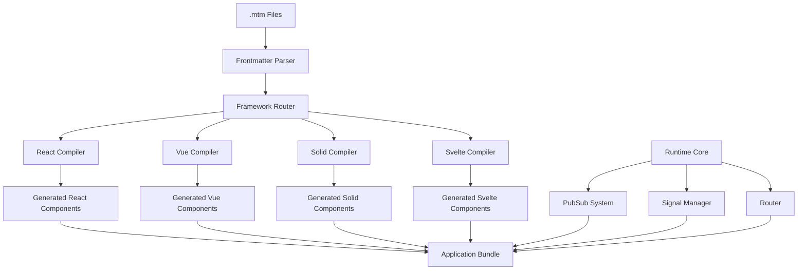

# Metamon Framework Design Document

## Overview

Metamon is a meta-framework that enables developers to write components and pages in .mtm files with frontmatter configuration, targeting specific JavaScript frameworks while sharing state and events through a unified system. The framework provides a build-time transformation layer that converts .mtm files into framework-specific components while maintaining a shared runtime for cross-framework communication.

## Architecture

### High-Level Architecture



### Core Components

1. **Build-Time Layer**: Transforms .mtm files into framework-specific components
2. **Runtime Layer**: Provides shared services (pub/sub, signals, routing)
3. **Framework Adapters**: Bridge between runtime services and framework-specific implementations

## Components and Interfaces

### 1. File Parser

**Purpose**: Parse .mtm files and extract frontmatter configuration

```typescript
interface MTMFile {
  frontmatter: {
    target: 'reactjs' | 'vue' | 'solid' | 'svelte';
    channels?: Array<{
      event: string;
      emit: string;
    }>;
    route?: string;
    layout?: string;
  };
  content: string;
  filePath: string;
}

interface FileParser {
  parse(filePath: string): MTMFile;
  validate(frontmatter: any): ValidationResult;
}
```

### 2. Framework Compilers

**Purpose**: Transform .mtm content into framework-specific components

```typescript
interface FrameworkCompiler {
  compile(mtmFile: MTMFile): CompilationResult;
  generateImports(dependencies: string[]): string;
  wrapWithRuntime(component: string, channels: Channel[]): string;
}

interface CompilationResult {
  code: string;
  dependencies: string[];
  exports: string[];
  sourceMap?: string;
}
```

### 3. PubSub System

**Purpose**: Enable cross-framework event communication

```typescript
interface PubSubSystem {
  subscribe(event: string, callback: Function, componentId: string): void;
  unsubscribe(event: string, componentId: string): void;
  emit(event: string, payload: any): void;
  cleanup(componentId: string): void;
}

class MetamonPubSub implements PubSubSystem {
  private listeners: Map<string, Set<EventListener>>;
  private componentListeners: Map<string, Set<string>>;
}
```

### 4. Signal Manager

**Purpose**: Provide cross-framework reactive state management

```typescript
interface SignalManager {
  createSignal<T>(initialValue: T, key?: string): Signal<T>;
  getSignal<T>(key: string): Signal<T> | undefined;
  destroySignal(key: string): void;
}

interface Signal<T> {
  value: T;
  subscribe(callback: (value: T) => void): () => void;
  update(newValue: T): void;
}
```

### 5. Router

**Purpose**: Handle client-side routing for .mtm pages

```typescript
interface MetamonRouter {
  register(path: string, component: string, framework: string): void;
  navigate(path: string, params?: Record<string, any>): void;
  getCurrentRoute(): RouteInfo;
  onRouteChange(callback: (route: RouteInfo) => void): void;
}

interface RouteInfo {
  path: string;
  params: Record<string, any>;
  query: Record<string, any>;
  component: string;
  framework: string;
}
```

## Data Models

### MTM File Structure

```yaml
---
target: reactjs
channels:
  - event: userLogin
    emit: onUserLogin
  - event: dataUpdate
    emit: onDataUpdate
route: /dashboard
layout: main
---

import React, { useState } from 'react';

export default function Dashboard() {
  const [user, setUser] = useState(null);
  
  // Framework-specific code here
  return <div>Dashboard Content</div>;
}
```

### Framework Adapter Interface

```typescript
interface FrameworkAdapter {
  name: string;
  fileExtension: string;
  compile(content: string, config: MTMConfig): string;
  injectRuntime(component: string): string;
  setupSignalIntegration(): string;
  setupPubSubIntegration(channels: Channel[]): string;
}
```

## Error Handling

### Compilation Errors

```typescript
interface CompilationError {
  type: 'syntax' | 'frontmatter' | 'framework' | 'runtime';
  message: string;
  file: string;
  line?: number;
  column?: number;
  suggestions?: string[];
}

class ErrorHandler {
  handleCompilationError(error: CompilationError): void;
  formatErrorMessage(error: CompilationError): string;
  provideSuggestions(error: CompilationError): string[];
}
```

### Runtime Error Handling

- PubSub event delivery failures
- Signal update conflicts
- Route resolution errors
- Framework adapter failures

## Testing Strategy

### Unit Testing

1. **File Parser Tests**
   - Frontmatter parsing accuracy
   - Content extraction
   - Validation logic

2. **Compiler Tests**
   - Framework-specific code generation
   - Import resolution
   - Runtime injection

3. **Runtime System Tests**
   - PubSub event delivery
   - Signal reactivity
   - Router navigation

### Integration Testing

1. **Cross-Framework Communication**
   - React ↔ Vue component communication
   - Signal sharing between frameworks
   - Event propagation across framework boundaries

2. **Build Process Testing**
   - End-to-end compilation
   - Bundle generation
   - Source map accuracy

### End-to-End Testing

1. **Application Scenarios**
   - Multi-framework page navigation
   - Component interaction workflows
   - State management across frameworks

## Framework-Specific Implementations

### React Integration

```typescript
class ReactAdapter implements FrameworkAdapter {
  compile(content: string, config: MTMConfig): string {
    // Transform to React component
    // Inject hooks for signals and pubsub
    // Handle JSX compilation
  }
  
  setupSignalIntegration(): string {
    return `
      import { useSignal } from '@metamon/react-adapter';
      // React-specific signal hooks
    `;
  }
}
```

### Vue Integration

```typescript
class VueAdapter implements FrameworkAdapter {
  compile(content: string, config: MTMConfig): string {
    // Transform to Vue component
    // Inject composition API for signals
    // Handle template compilation
  }
  
  setupSignalIntegration(): string {
    return `
      import { useMetamonSignal } from '@metamon/vue-adapter';
      // Vue-specific reactivity integration
    `;
  }
}
```

### Solid Integration

```typescript
class SolidAdapter implements FrameworkAdapter {
  compile(content: string, config: MTMConfig): string {
    // Transform to Solid component
    // Use native Solid signals
    // Handle JSX compilation with Solid
  }
}
```

### Svelte Integration

```typescript
class SvelteAdapter implements FrameworkAdapter {
  compile(content: string, config: MTMConfig): string {
    // Transform to Svelte component
    // Integrate with Svelte stores
    // Handle Svelte compilation
  }
}
```

## Build System Integration

### Vite Plugin

```typescript
export function metamon(options: MetamonOptions): Plugin {
  return {
    name: 'metamon',
    load(id) {
      if (id.endsWith('.mtm')) {
        return transformMTMFile(id);
      }
    },
    handleHotUpdate(ctx) {
      if (ctx.file.endsWith('.mtm')) {
        return handleMTMHotUpdate(ctx);
      }
    }
  };
}
```

### Webpack Plugin

```typescript
class MetamonWebpackPlugin {
  apply(compiler: Compiler) {
    compiler.hooks.compilation.tap('MetamonPlugin', (compilation) => {
      // Handle .mtm file processing
    });
  }
}
```

## Performance Considerations

### Build-Time Optimizations

- Incremental compilation for changed .mtm files
- Parallel processing of framework-specific compilations
- Caching of compiled components
- Tree-shaking of unused runtime features

### Runtime Optimizations

- Event batching in PubSub system
- Signal update batching
- Lazy loading of framework adapters
- Memory cleanup for destroyed components

## Security Considerations

- Sanitization of frontmatter input
- Validation of event channel configurations
- Prevention of XSS in generated components
- Secure handling of cross-framework data transfer