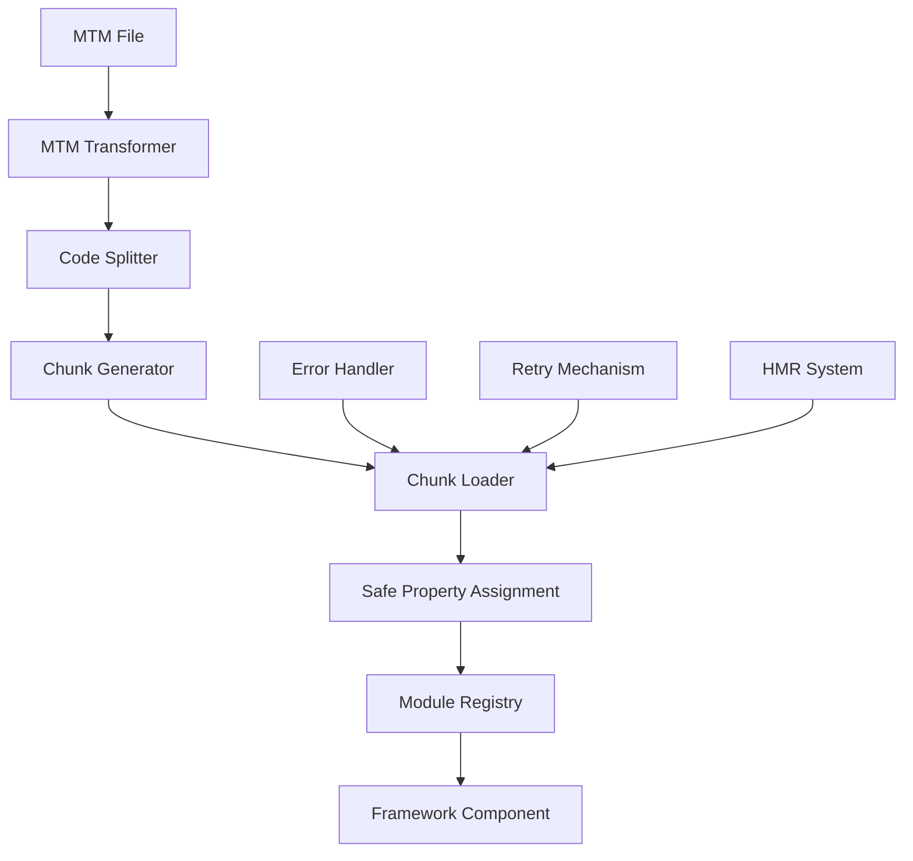

# Chunk Loading Mechanism

Comprehensive technical documentation for the Metamon framework's chunk loading system, including architecture, troubleshooting, and best practices.

## 📋 Table of Contents

- [Overview](#overview)
- [Architecture](#architecture)
- [How Chunk Loading Works](#how-chunk-loading-works)
- [Safe Property Assignment](#safe-property-assignment)
- [Error Handling](#error-handling)
- [Common Issues](#common-issues)
- [Troubleshooting](#troubleshooting)
- [Best Practices](#best-practices)
- [API Reference](#api-reference)

## Overview

The Metamon framework uses a sophisticated chunk loading mechanism to dynamically load components and modules at runtime. This system enables code splitting, lazy loading, and hot module replacement while maintaining compatibility across different JavaScript frameworks (React, Vue, Svelte, Solid).

### Key Features

- **Framework Agnostic**: Works with React, Vue, Svelte, Solid, and vanilla JavaScript
- **Safe Property Assignment**: Handles complex property descriptors and getter-only properties
- **Error Recovery**: Comprehensive error handling with retry mechanisms
- **Hot Module Replacement**: Seamless development experience with HMR support
- **Performance Optimized**: Minimal overhead with caching and batching

## Architecture

The chunk loading system consists of several interconnected components:



### Core Components

1. **MTM Transformer**: Converts .mtm files into framework-specific JavaScript
2. **Code Splitter**: Analyzes dependencies and creates chunks
3. **Chunk Generator**: Produces loadable chunk files
4. **Chunk Loader**: Runtime system for loading and executing chunks
5. **Safe Property Assignment**: Handles complex property scenarios
6. **Module Registry**: Manages loaded modules and dependencies
7. **Error Handler**: Provides comprehensive error handling and recovery

## How Chunk Loading Works

### 1. Chunk Generation

During the build process, the MTM transformer analyzes .mtm files and generates chunks:

```javascript
// Original .mtm file
---
framework: react
route: /dashboard
---
<template>
  <div class="dashboard">
    <h1>{$title}</h1>
    <UserList users={$users} />
  </div>
</template>

// Generated chunk
export default function Dashboard() {
  const $title = signal('title', 'Dashboard');
  const $users = signal('users', []);

  return React.createElement('div', { className: 'dashboard' },
    React.createElement('h1', null, $title),
    React.createElement(UserList, { users: $users })
  );
}
```

### 2. Dynamic Loading

At runtime, chunks are loaded dynamically when needed:

```javascript
// Chunk loading process
const loadChunk = async (chunkId) => {
  try {
    // 1. Fetch the chunk
    const module = await import(`./chunks/${chunkId}.js`);

    // 2. Apply safe property assignment
    const processedModule = safeAssign(module, "data", {
      id: chunkId,
      loaded: true,
      timestamp: Date.now(),
    });

    // 3. Register in module registry
    moduleRegistry.register(chunkId, processedModule);

    // 4. Return the loaded module
    return processedModule;
  } catch (error) {
    // 5. Handle errors with retry mechanism
    return handleChunkError(chunkId, error);
  }
};
```

### 3. Module Processing

Each loaded chunk goes through several processing steps:

1. **Property Descriptor Analysis**: Check for getter-only properties
2. **Safe Assignment**: Use appropriate assignment strategy
3. **Framework Integration**: Apply framework-specific processing
4. **Dependency Resolution**: Resolve and load dependencies
5. **Registration**: Register in the module registry

## Safe Property Assignment

The core innovation of Metamon's chunk loading system is the safe property assignment mechanism, which handles complex property descriptor scenarios that cause the original TypeError.

### The Problem

Standard property assignment fails when objects have getter-only properties:

```javascript
// This fails with: TypeError: Cannot set property data of #<Object> which has only a getter
const module = {
  get data() {
    return this._data;
  },
  // No setter defined
};

module.data = { loaded: true }; // ❌ Throws TypeError
```

### The Solution

The `safeAssign` utility provides multiple strategies for safe property assignment:

```javascript
function safeAssign(obj, prop, value) {
  const descriptor = Object.getOwnPropertyDescriptor(obj, prop);

  if (descriptor && descriptor.get && !descriptor.set) {
    // Strategy 1: Try to add a setter
    try {
      Object.defineProperty(obj, prop, {
        ...descriptor,
        set(newValue) {
          Object.defineProperty(this, "_" + prop, {
            value: newValue,
            writable: true,
          });
        },
      });
      obj[prop] = value;
      return obj;
    } catch (e) {
      // Strategy 2: Create a new object
      return createNewObjectWithProperty(obj, prop, value);
    }
  } else {
    // Standard assignment
    obj[prop] = value;
    return obj;
  }
}
```

### Assignment Strategies

1. **Direct Assignment**: For normal properties
2. **Setter Addition**: Add a setter to getter-only properties
3. **Property Redefinition**: Redefine the property as writable
4. **Object Recreation**: Create a new object with the desired property
5. **Proxy Wrapping**: Use a Proxy to intercept property access

### Example Usage

```javascript
// Safe assignment in action
const module = createModuleWithGetterOnlyProperty();

// This will succeed using the appropriate strategy
const result = safeAssign(module, "data", {
  id: "chunk-123",
  loaded: true,
});

console.log(result.data); // { id: 'chunk-123', loaded: true }
```

## Error Handling

The chunk loading system includes comprehensive error handling with classification and recovery mechanisms.

### Error Types

```javascript
// Network-related errors
class ChunkNetworkError extends Error {
  constructor(chunkId, url, originalError) {
    super(`Failed to load chunk ${chunkId} from ${url}`);
    this.chunkId = chunkId;
    this.url = url;
    this.originalError = originalError;
    this.type = "network";
  }
}

// Parse-related errors
class ChunkParseError extends Error {
  constructor(chunkId, originalError) {
    super(`Failed to parse chunk ${chunkId}`);
    this.chunkId = chunkId;
    this.originalError = originalError;
    this.type = "parse";
  }
}

// Execution-related errors
class ChunkExecutionError extends Error {
  constructor(chunkId, phase, originalError) {
    super(`Failed to execute chunk ${chunkId} in ${phase} phase`);
    this.chunkId = chunkId;
    this.phase = phase;
    this.originalError = originalError;
    this.type = "execution";
  }
}

// Property assignment errors
class ChunkPropertyError extends Error {
  constructor(chunkId, property, originalError) {
    super(`Failed to assign property ${property} on chunk ${chunkId}`);
    this.chunkId = chunkId;
    this.property = property;
    this.originalError = originalError;
    this.type = "property";
  }
}
```

### Error Classification

```javascript
function classifyChunkError(error, chunkId, context = {}) {
  if (error.message.includes("Failed to fetch")) {
    return new ChunkNetworkError(chunkId, context.url, error);
  }

  if (error.message.includes("Unexpected token")) {
    return new ChunkParseError(chunkId, error);
  }

  if (error.message.includes("Cannot set property")) {
    return new ChunkPropertyError(chunkId, context.property, error);
  }

  return new ChunkExecutionError(chunkId, context.phase || "unknown", error);
}
```

### Retry Mechanism

```javascript
const withRetry = (loader, options = {}) => {
  const {
    maxRetries = 3,
    baseDelay = 1000,
    backoffFactor = 2,
    retryCondition = (error) => error.type === "network",
  } = options;

  return async (chunkId, ...args) => {
    let lastError;

    for (let attempt = 0; attempt <= maxRetries; attempt++) {
      try {
        return await loader(chunkId, ...args);
      } catch (error) {
        lastError = classifyChunkError(error, chunkId);

        if (attempt === maxRetries || !retryCondition(lastError)) {
          throw lastError;
        }

        const delay = baseDelay * Math.pow(backoffFactor, attempt);
        await new Promise((resolve) => setTimeout(resolve, delay));
      }
    }

    throw lastError;
  };
};
```

## Common Issues

### 1. TypeError: Cannot set property data

**Symptom**: `TypeError: Cannot set property data of #<Object> which has only a getter`

**Cause**: The chunk loader is trying to assign a property to an object that has a getter but no setter.

**Solution**: The safe property assignment mechanism automatically handles this.

```javascript
// The error occurs here:
module.data = { loaded: true }; // ❌

// Fixed with safe assignment:
const result = safeAssign(module, "data", { loaded: true }); // ✅
```

### 2. Chunk Loading Timeout

**Symptom**: Chunks fail to load after a timeout period

**Cause**: Network issues, server problems, or large chunk sizes

**Solution**: Configure retry mechanism and optimize chunk sizes

```javascript
const loader = withRetry(chunkLoader, {
  maxRetries: 5,
  baseDelay: 2000,
  retryCondition: (error) => error.type === "network",
});
```

### 3. Circular Dependencies

**Symptom**: Chunks fail to load due to circular dependency errors

**Cause**: Modules that depend on each other creating a circular reference

**Solution**: Restructure dependencies or use lazy loading

```javascript
// ❌ Circular dependency
// moduleA.js imports moduleB.js
// moduleB.js imports moduleA.js

// ✅ Break the cycle with lazy loading
const moduleB = lazy(() => import("./moduleB.js"));
```

### 4. Framework Compatibility Issues

**Symptom**: Components don't render correctly after chunk loading

**Cause**: Framework-specific requirements not met during chunk processing

**Solution**: Ensure proper framework integration

```javascript
// React components need proper $$typeof
const reactComponent = {
  $$typeof: Symbol.for("react.element"),
  type: ComponentFunction,
  props: {},
  key: null,
  ref: null,
};

// Vue components need proper structure
const vueComponent = {
  name: "ComponentName",
  setup() {
    /* ... */
  },
  template: "...",
};
```

## Troubleshooting

### Debug Mode

Enable debug mode to get detailed logging:

```javascript
// Enable chunk loading debug mode
localStorage.setItem("mtm:chunk-debug", "true");

// Or programmatically
window.mtmChunkDebug = true;
```

### Diagnostic Tools

```javascript
// Check chunk loading status
console.log(moduleRegistry.getAll());

// Monitor chunk loading events
chunkLoader.on("load-start", (chunkId) => {
  console.log(`Loading chunk: ${chunkId}`);
});

chunkLoader.on("load-success", (chunkId, module) => {
  console.log(`Loaded chunk: ${chunkId}`, module);
});

chunkLoader.on("load-error", (chunkId, error) => {
  console.error(`Failed to load chunk: ${chunkId}`, error);
});
```

### Performance Monitoring

```javascript
// Monitor chunk loading performance
const perfMonitor = {
  start(chunkId) {
    performance.mark(`chunk-load-start-${chunkId}`);
  },

  end(chunkId) {
    performance.mark(`chunk-load-end-${chunkId}`);
    performance.measure(
      `chunk-load-${chunkId}`,
      `chunk-load-start-${chunkId}`,
      `chunk-load-end-${chunkId}`
    );
  },

  getMetrics() {
    return performance
      .getEntriesByType("measure")
      .filter((entry) => entry.name.startsWith("chunk-load-"));
  },
};
```

### Common Debugging Steps

1. **Check Network Tab**: Verify chunks are being requested and loaded
2. **Inspect Console**: Look for error messages and warnings
3. **Verify Module Registry**: Check if modules are properly registered
4. **Test Property Descriptors**: Verify object property configurations
5. **Check Framework Integration**: Ensure framework-specific requirements are met

## Best Practices

### 1. Chunk Size Optimization

```javascript
// Configure optimal chunk sizes
const chunkConfig = {
  maxSize: 250000, // 250KB max chunk size
  minSize: 20000, // 20KB min chunk size
  cacheGroups: {
    vendor: {
      test: /[\\/]node_modules[\\/]/,
      name: "vendors",
      chunks: "all",
    },
    common: {
      minChunks: 2,
      chunks: "all",
      enforce: true,
    },
  },
};
```

### 2. Error Handling Strategy

```javascript
// Implement comprehensive error handling
const robustChunkLoader = async (chunkId) => {
  try {
    return await loadChunk(chunkId);
  } catch (error) {
    // Log error for monitoring
    errorReporter.report(error, { chunkId, context: "chunk-loading" });

    // Show user-friendly error
    showChunkLoadError(chunkId, error);

    // Return fallback component
    return getFallbackComponent(chunkId);
  }
};
```

### 3. Preloading Strategy

```javascript
// Preload critical chunks
const preloadCriticalChunks = async () => {
  const criticalChunks = ["header", "navigation", "footer"];

  await Promise.all(
    criticalChunks.map((chunkId) =>
      loadChunk(chunkId).catch((error) =>
        console.warn(`Failed to preload ${chunkId}:`, error)
      )
    )
  );
};
```

### 4. Caching Strategy

```javascript
// Implement intelligent caching
const chunkCache = new Map();

const cachedChunkLoader = async (chunkId) => {
  if (chunkCache.has(chunkId)) {
    return chunkCache.get(chunkId);
  }

  const module = await loadChunk(chunkId);
  chunkCache.set(chunkId, module);

  return module;
};
```

## API Reference

### ChunkLoader

```typescript
interface ChunkLoader {
  load(chunkId: string): Promise<any>;
  preload(chunkId: string): Promise<void>;
  unload(chunkId: string): void;
  isLoaded(chunkId: string): boolean;
  on(event: string, handler: Function): void;
  off(event: string, handler: Function): void;
}
```

### SafeAssign

```typescript
function safeAssign<T>(obj: T, prop: string | symbol, value: any): T;
```

### ModuleRegistry

```typescript
interface ModuleRegistry {
  register(id: string, module: any): void;
  get(id: string): any;
  has(id: string): boolean;
  unregister(id: string): void;
  getAll(): Map<string, any>;
  clear(): void;
}
```

### Error Classes

```typescript
class ChunkNetworkError extends Error {
  chunkId: string;
  url: string;
  originalError: Error;
  type: "network";
}

class ChunkParseError extends Error {
  chunkId: string;
  originalError: Error;
  type: "parse";
}

class ChunkExecutionError extends Error {
  chunkId: string;
  phase: string;
  originalError: Error;
  type: "execution";
}

class ChunkPropertyError extends Error {
  chunkId: string;
  property: string;
  originalError: Error;
  type: "property";
}
```

### Retry Utilities

```typescript
interface RetryOptions {
  maxRetries?: number;
  baseDelay?: number;
  backoffFactor?: number;
  retryCondition?: (error: Error) => boolean;
}

function withRetry<T extends (...args: any[]) => Promise<any>>(
  fn: T,
  options?: RetryOptions
): T;
```

---

For more information, see:

- [Troubleshooting Guide](./TROUBLESHOOTING.md)
- [Migration Guide](./MIGRATION_GUIDE.md)
- [Deployment Guide](./DEPLOYMENT_GUIDE.md)
